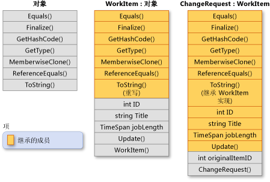

# 继承（C# 编程指南）
继承（加上封装和多形性）是面向对象的编程的三个主要特性（也称为“支柱”）之一。  继承用于创建可重用、扩展和修改在其他类中定义的行为的新类。  其成员被继承的类称为“基类”，继承这些成员的类称为“派生类”。  派生类只能有一个直接基类。  但是，继承是可传递的。  如果 ClassB 派生出 ClassC，ClassA 派生出 ClassB，则 ClassC 会继承 ClassB 和 ClassA 中声明的成员。  
  
> [!NOTE]
>  结构不支持继承，但可以实现接口。  有关更多信息，请参见 [接口](../../../csharp/programming-guide/interfaces/index.md)。  
  
 从概念上来说，派生类是基类的专用化。  例如，如果您有一个基类 `Animal`，则可以有一个名为 `Mammal` 的派生类和一个名为 `Reptile` 的派生类。  `Mammal` 是一个 `Animal`，`Reptile` 也是一个 `Animal`，但每个派生类均表示基类的不同专用化。  
  
 定义一个类从其他类派生时，派生类隐式获得基类的除构造函数和析构函数以外的所有成员。  因此，派生类可以重用基类中的代码而无需重新实现这些代码。  可以在派生类中添加更多成员。  派生类以这种方式扩展基类的功能。  
  
 下图演示一个 `WorkItem` 类，该类表示某业务流程中的一个工作项。  和所有的类一样，该类派生自 <xref:System.Object?displayProperty=fullName> 并继承其所有方法。  `WorkItem` 添加了自己的五个成员。  其中包括一个构造函数，因为构造函数不能继承。  类`ChangeRequest` 继承自 `WorkItem` 并表示特定种类的工作项。  `ChangeRequest` 在它从 `WorkItem` 和 <xref:System.Object> 继承的成员中另外添加了两个成员。  它必须添加其自己的构造函数，还添加 `originalItemID`。  利用属性 `originalItemID`，可将 `ChangeRequest` 实例与更改请求将应用到的原始 `WorkItem` 相关联。  
  
   
类继承  
  
 下面的示例演示如何以 C\# 表示上图所示的类关系。  该示例还演示 `WorkItem` 如何重写虚方法 <xref:System.Object.ToString%2A?displayProperty=fullName>，以及 `ChangeRequest` 类如何继承该方法的 `WorkItem` 实现。  
  
 [!code-cs[csProgGuideInheritance#49](../../../csharp/programming-guide/classes-and-structs/codesnippet/CSharp/inheritance_1.cs)]  
  
## 抽象方法和虚方法  
 当基类将方法声明为 [virtual](../../../csharp/language-reference/keywords/virtual.md) 时，派生类可以用自己的实现[重写](../../../csharp/language-reference/keywords/override.md)该方法。  如果基类将成员声明为 [abstract](../../../csharp/language-reference/keywords/abstract.md)，则在直接继承自该类的任何非抽象类中都必须重写该方法。  如果派生类自身是抽象的，则它继承抽象成员而不实现它们。  抽象成员和虚成员是多态性的基础，多态性是面向对象的编程的第二个主要特性。  有关更多信息，请参见 [多态性](../../../csharp/programming-guide/classes-and-structs/polymorphism.md)。  
  
## 抽象基类  
 如果希望禁止通过 [new](../../../csharp/language-reference/keywords/new.md)关键字直接进行实例化，可以将类声明为[abstract](../../../csharp/language-reference/keywords/abstract.md) 如果这样做，则仅当从该类派生新类时才能使用该类。  抽象类可以包含一个或多个自身声明为抽象的方法签名。  这些签名指定参数和返回值，但没有实现（方法体）。  抽象类不必包含抽象成员；但是，如果某个类确实包含抽象成员，则该类自身必须声明为抽象类。  自身不是抽象类的派生类必须为抽象基类中的任何抽象方法提供实现。  有关更多信息，请参见 [抽象类、密封类及类成员](../../../csharp/programming-guide/classes-and-structs/abstract-and-sealed-classes-and-class-members.md)。  
  
## 接口  
 “接口”是一种引用类型，有点像仅包含抽象成员的抽象基类。  类在从接口实现时必须为该接口的所有成员提供实现。  类虽然只能从一个直接基类派生，但可以实现多个接口。  
  
 接口用于为不一定具有“是”关系的类定义特定功能。  例如，<xref:System.IEquatable%601?displayProperty=fullName> 接口可由任何类或构造实现，这些类或构造必须启用代码来确定该类型的两个对象是否等效（但是该类型定义等效性）。  <xref:System.IEquatable%601> 不表示基类和派生类之间存在的同一种“是”关系（例如 `Mammal` 是 `Animal`）。  有关更多信息，请参见 [接口](../../../csharp/programming-guide/interfaces/index.md)。  
  
## 派生类对基类成员的访问  
 派生类可以访问基类的公共成员、受保护成员、内部成员和受保护内部成员。  即使派生类继承基类的私有成员，仍不能访问这些成员。  但是，所有这些私有成员在派生类中仍然存在，且执行与基类自身中相同的工作。  例如，假定一个受保护基类方法访问私有字段。  要使继承的基类方法正常工作，派生类中必须有该字段。  
  
## 禁止进一步派生  
 类可以将自身或其成员声明为 [sealed](../../../csharp/language-reference/keywords/sealed.md)，从而禁止其他类从该类自身或其任何成员继承。  有关更多信息，请参见 [抽象类、密封类及类成员](../../../csharp/programming-guide/classes-and-structs/abstract-and-sealed-classes-and-class-members.md)。  
  
## 派生类隐藏基类成员  
 派生类可以通过以相同的名称和签名声明基类成员来隐藏这些成员。  可以使用 [new](../../../csharp/language-reference/keywords/new.md) 修饰符显式指示成员不作为基类成员的重写。  不是必须要使用 [new](../../../csharp/language-reference/keywords/new.md)，但如果不使用 [new](../../../csharp/language-reference/keywords/new.md)，将生成编译器警告。  有关更多信息，请参见[使用 Override 和 New 关键字进行版本控制](../../../csharp/programming-guide/classes-and-structs/versioning-with-the-override-and-new-keywords.md)和 [了解何时使用 Override 和 New 关键字](../../../csharp/programming-guide/classes-and-structs/knowing-when-to-use-override-and-new-keywords.md)。  
  
## 请参阅  
 [C\# 编程指南](../../../csharp/programming-guide/index.md)   
 [类和结构](../../../csharp/programming-guide/classes-and-structs/index.md)   
 [类](../../../csharp/language-reference/keywords/class.md)   
 [struct](../../../csharp/language-reference/keywords/struct.md)