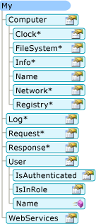

# My 对项目类型的依赖方式 (Visual Basic)
`My`只公开这些对象所需的特定项目类型。 例如，`My.Forms`对象是在 Windows 窗体应用程序中可用，但在一个控制台应用程序中不可用。 本主题介绍其中`My`对象类型都提供不同的项目。  
  
## 我在 Windows 应用程序和网站  
 `My`将在当前的项目类型; 非常有用的对象公开将禁止不适用的对象。 例如下, 图显示`My`Windows 窗体项目中的对象模型。  
  
   
  
 在网站项目中，`My`公开为 Web 开发人员相关的对象 (如`My.Request`和`My.Response`对象) 时禁止不相关的对象 (如`My.Forms`对象)。 下图显示`My`网站项目中的对象模型︰  
  
   
  
## 项目详细信息  
 下表显示了哪些`My`对象启用默认情况下了八个项目类型︰ Windows 应用程序、 类库、 控制台应用程序、 Windows 控件库、 Web 控件库、 Windows 服务、 为空和网站。  
  
 有三个版本的`My.Application`对象、 两个版本的`My.Computer`对象和两个版本的`My.User`对象; 在下表之后的批注中给出有关这些版本的详细信息。  
  
|My 对象|Windows 应用程序|类库|控制台应用程序|Windows 控件库|Web 控件库|Windows 服务|空|网站|  
|---|---|---|---|---|---|---|---|---|  
|`My.Application`|**Yes** 1|**Yes** 2|**Yes** 3|**Yes** 2|否|**Yes** 3|否|否|  
|`My.Computer`|**Yes** 4|**Yes** 4|**Yes** 4|**Yes** 4|**Yes** 5|**Yes** 4|否|**Yes** 5|  
|`My.Forms`|**是**|否|否|**是**|否|否|否|否|  
|`My.Log`|否|否|否|否|否|否|否|**是**|  
|`My.Request`|否|否|否|否|否|否|否|**是**|  
|`My.Resources`|**是**|**是**|**是**|**是**|**是**|**是**|否|否|  
|`My.Response`|否|否|否|否|否|否|否|**是**|  
|`My.Settings`|**是**|**是**|**是**|**是**|**是**|**是**|否|否|  
|`My.User`|**Yes** 6|**Yes** 6|**Yes** 6|**Yes** 6|**Yes** 7|**Yes** 6|否|**Yes** 7|  
|`My.WebServices`|**是**|**是**|**是**|**是**|**是**|**是**|否|否|  
  
 1的 Windows 窗体版本`My.Application`。 派生自控制台版本 （请参阅备注 3）;添加对与应用程序的 windows 进行交互的支持，并提供[!INCLUDE[vbprvb](../../../csharp/programming-guide/concepts/linq/includes/vbprvb_md.md)]应用程序模型。  
  
 2 library 版本`My.Application`。 提供应用程序所需的基本功能︰ 提供用于写入应用程序日志和访问应用程序信息的成员。  
  
 3的控制台版本`My.Application`。 派生自的库版本 （请参阅备注 2），并将其他成员添加用于访问应用程序的命令行参数和 ClickOnce 部署信息。  
  
 4的 Windows 版本`My.Computer`。 派生自的服务器版本 （请参阅备注 5），并在客户端计算机上，如键盘、 屏幕和鼠标提供对有用对象的访问。  
  
 5服务器版本`My.Computer`。 提供基本信息的计算机，如名称、 访问的时钟，依次类推。  
  
 6的 Windows 版本`My.User`。 此对象是与线程的当前标识相关联。  
  
 7 web 版本`My.User`。 此对象是与应用程序的当前 HTTP 请求的用户标识相关联。  
  
## 请参见  
 <xref:Microsoft.VisualBasic.ApplicationServices.ApplicationBase></xref:Microsoft.VisualBasic.ApplicationServices.ApplicationBase>   
 <xref:Microsoft.VisualBasic.Devices.Computer></xref:Microsoft.VisualBasic.Devices.Computer>   
 <xref:Microsoft.VisualBasic.Logging.Log></xref:Microsoft.VisualBasic.Logging.Log>   
 <xref:Microsoft.VisualBasic.ApplicationServices.User></xref:Microsoft.VisualBasic.ApplicationServices.User>   
 [自定义的对象都将在我](../../../visual-basic/developing-apps/customizing-extending-my/customizing-which-objects-are-available-in-my.md)   
 [条件编译](../../../visual-basic/programming-guide/program-structure/conditional-compilation.md)   
 [/define (Visual Basic)](../../../visual-basic/reference/command-line-compiler/define.md)   
 [My.Forms 对象](../../../visual-basic/language-reference/objects/my-forms-object.md)   
 [My.Request 对象](../../../visual-basic/language-reference/objects/my-request-object.md)   
 [My.Response 对象](../../../visual-basic/language-reference/objects/my-response-object.md)   
 [My.WebServices 对象](../../../visual-basic/language-reference/objects/my-webservices-object.md)
