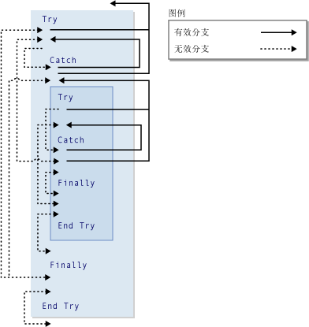

# GoTo 语句
[!INCLUDE[vs2017banner](../../../csharp/includes/vs2017banner.md)]

无条件地跳转到过程内的指定行。  
  
## 语法  
  
```  
GoTo line  
```  
  
## 组成部分  
 `line`  
 必选。  任何行标签。  
  
## 备注  
 `GoTo` 语句只能跳转到它所在过程内的行。  该行必须有 `GoTo` 可以引用的行标签。  有关更多信息，请参见[如何：标记语句](../../../visual-basic/programming-guide/program-structure/how-to-label-statements.md)。  
  
> [!NOTE]
>  `GoTo` 语句使代码的阅读和维护变得更加困难。  应该尽可能使用控制结构。  有关更多信息，请参见 [控制流](../../../visual-basic/programming-guide/language-features/control-flow/index.md)。  
  
 不能使用 `GoTo` 语句从 `For`...`Next`、`For Each`...`Next`、`SyncLock`...`End SyncLock`、`Try`...`Catch`...`Finally`、`With`...`End With` 或 `Using`...`End Using` 构造外部分支到构造内部的标签。  
  
## 分支与 Try 构造  
 在 `Try`...`Catch`...`Finally` 构造中，下列规则适用于通过 `GoTo` 语句执行的分支。  
  
|块或区域|从外向内分支|从内向外分支|  
|----------|------------|------------|  
|`Try` 块|只能从同一个构造 <sup>1</sup> 的 `Catch` 块分支|只能跳转到整个构造外部|  
|`Catch` 块|不允许|只能跳转到整个构造外部，或跳转到同一个构造 <sup>1</sup> 的 `Try` 块|  
|`Finally` 块|不允许|不允许|  
  
 <sup>1</sup> 如果一个 `Try`...`Catch`...`Finally` 构造嵌套在另一个构造中，则 `Catch` 块可以分支到它自己的嵌套级别上的 `Try` 块中，但不能分支到任何其他 `Try` 块中。  嵌套的 `Try`...`Catch`...`Finally` 构造必须完全包含在其所嵌入构造的 `Try` 或 `Catch` 块中。  
  
 下图显示一个 `Try` 构造，它嵌套在另一个 Try 构造中。  这两个构造的块之间的各种不同分支被标示为有效或无效。  
  
   
Try 构造中的有效和无效分支  
  
## 示例  
 下面的示例使用 `GoTo` 语句跳转到过程内的行标签。  
  
 [!code-vb[VbVbalrStatements#31](../../../visual-basic/language-reference/error-messages/codesnippet/VisualBasic/goto-statement_1.vb)]  
  
## 请参阅  
 [Do...Loop 语句](../../../visual-basic/language-reference/statements/do-loop-statement.md)   
 [For...Next 语句](../../../visual-basic/language-reference/statements/for-next-statement.md)   
 [For Each...Next 语句](../../../visual-basic/language-reference/statements/for-each-next-statement.md)   
 [If...Then...Else 语句](../../../visual-basic/language-reference/statements/if-then-else-statement.md)   
 [Select...Case 语句](../../../visual-basic/language-reference/statements/select-case-statement.md)   
 [Try...Catch...Finally 语句](../../../visual-basic/language-reference/statements/try-catch-finally-statement.md)   
 [While...End While 语句](../../../visual-basic/language-reference/statements/while-end-while-statement.md)   
 [With...End With 语句](../../../visual-basic/language-reference/statements/with-end-with-statement.md)