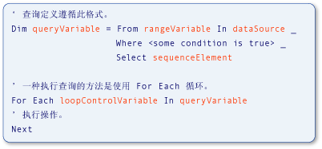

# Type Relationships in Query Operations (Visual Basic)
[!INCLUDE[vs2017banner](../../../../csharp/includes/vs2017banner.md)]

[!INCLUDE[vbteclinqext](../../../../csharp/programming-guide/concepts/linq/includes/vbteclinqext_md.md)] 查询操作中使用的变量是强类型的，因而必须互相兼容。  在数据源、查询本身及查询执行中都使用强类型。  下图标识用于描述 [!INCLUDE[vbteclinq](../../../../csharp/includes/vbteclinq_md.md)] 查询的术语。  有关查询的各部分的更多信息，请参见[基本查询操作 \(Visual Basic\)](../../../../visual-basic/programming-guide/concepts/linq/basic-query-operations.md)。  
  
   
LINQ 查询的各部分  
  
 查询中范围变量的类型必须与数据源中元素的类型兼容。  查询变量的类型必须与 `Select` 子句中定义的序列元素兼容。  最后，序列元素的类型也必须与执行查询的 `For Each` 语句中使用的循环控制变量的类型兼容。  此强类型便于在编译时识别类型错误。  
  
 [!INCLUDE[vbprvb](../../../../csharp/programming-guide/concepts/linq/includes/vbprvb_md.md)] 通过实现局部类型推断（又称为“隐式类型”）使强类型变得方便易用。  在上一个示例中就使用了该功能，并且您将看到在所有 [!INCLUDE[vbteclinq](../../../../csharp/includes/vbteclinq_md.md)] 示例和文档中都使用了该功能。  在 Visual Basic 中，只需使用 `Dim` 语句，而无需 `As` 子句即可实现局部类型推断。  在下面的示例中，`city` 被强类型化为字符串。  
  
 [!code-vb[VbLINQTypeRels#1](../../../../visual-basic/programming-guide/concepts/linq/codesnippet/VisualBasic/type-relationships-in-query-operations_1.vb)]  
  
> [!NOTE]
>  仅当 `Option Infer` 设置为 `On` 时，局部类型推断才有效。  有关更多信息，请参见 [Option Infer 语句](../../../../visual-basic/language-reference/statements/option-infer-statement.md)。  
  
 但是，即使您在查询中使用局部类型推断，在数据源中的变量、查询变量和查询执行循环中也存在相同的类型关系。  当您编写 [!INCLUDE[vbteclinq](../../../../csharp/includes/vbteclinq_md.md)] 查询或使用文档中的示例和代码示例时，对这些类型关系有一个基本了解很有用。  
  
 对于与从数据源返回的类型不匹配的范围变量，您可能需要指定显式类型。  可通过使用 `As` 子句来指定范围变量的类型。  但是，如果转换为[收缩转换](../../../../visual-basic/programming-guide/language-features/data-types/widening-and-narrowing-conversions.md)，并且 `Option Strict` 设置为 `On`，则这样做会导致错误。  因此，建议您对从数据源中检索的值执行转换。  可通过使用 <xref:System.Linq.Enumerable.Cast%2A> 方法，将数据源中的值转换为显式范围变量类型。  还可以将 `Select` 子句中选定的值强制转换为与范围变量的类型不同的显式类型。  下面的代码中阐释了这几点。  
  
 [!code-vb[VbLINQTypeRels#4](../../../../visual-basic/programming-guide/concepts/linq/codesnippet/VisualBasic/type-relationships-in-query-operations_2.vb)]  
  
## 返回源数据的整个元素的查询  
 下面的示例演示返回从源数据选择的元素序列的 [!INCLUDE[vbteclinq](../../../../csharp/includes/vbteclinq_md.md)] 查询操作。  源 `names` 包含一个字符串数组，而查询输出是一个包含以字母 M 开头的字符串的序列。  
  
 [!code-vb[VbLINQTypeRels#2](../../../../visual-basic/programming-guide/concepts/linq/codesnippet/VisualBasic/type-relationships-in-query-operations_3.vb)]  
  
 它与下面的代码等效，但它更简短、更易于编写。  在查询中依赖局部类型推断是 Visual Basic 中优先采用的一种方式。  
  
 [!code-vb[VbLINQTypeRels#3](../../../../visual-basic/programming-guide/concepts/linq/codesnippet/VisualBasic/type-relationships-in-query-operations_4.vb)]  
  
 在前面两个代码示例中都存在下面的关系，无论类型是隐式还是显式确定的。  
  
1.  数据源 `names` 中元素的类型是查询中范围变量 `name` 的类型。  
  
2.  选择的对象 `name` 的类型决定查询变量 `mNames` 的类型。  此处的 `name` 是一个字符串，因此在 Visual Basic 中查询变量是 IEnumerable\(Of String\)。  
  
3.  `mNames` 中定义的查询在 `For Each` 循环中执行。  此循环将循环访问查询的执行结果。  因为 `mNames` 在执行时将返回一个字符串序列，所以循环迭代变量 `nm` 也是一个字符串。  
  
## 返回所选元素的一个字段的查询  
 下面的示例演示一个 [!INCLUDE[vbtecdlinq](../../../../csharp/language-reference/keywords/includes/vbtecdlinq_md.md)] 查询操作，该操作返回只包含从数据源选择的每个元素的一部分的序列。  此查询将 `Customer` 对象的集合作为其数据源，并只将 `Name` 属性投影在结果中。  因为客户姓名是一个字符串，所以此查询生成一个字符串序列作为输出。  
  
<CodeContentPlaceHolder>0</CodeContentPlaceHolder>  
 变量之间的关系与更简单的示例中的关系类似。  
  
1.  数据源 `customers` 中元素的类型是查询中范围变量 `cust` 的类型。  在此示例中，该类型为 `Customer`。  
  
2.  `Select` 语句返回每个 `Customer` 对象的 `Name` 属性，而非整个对象。  因为 `Name` 是一个字符串，所以查询变量 `custNames` 也将是 IEnumerable\(Of String\)，而不是 `Customer`。  
  
3.  因为 `custNames` 表示一个字符串序列，所以 `For Each` 循环的迭代变量 `custName` 必须是一个字符串。  
  
 如果不使用局部类型推断，上一个示例将很难编写和理解，如下面的示例所示。  
  
<CodeContentPlaceHolder>1</CodeContentPlaceHolder>  
## 需要匿名类型的查询  
 下面的示例演示更复杂的情况。  在上一个示例中，为所有变量显式指定类型不是很方便。  在此示例中，则根本不可能。  此查询中的 `Select` 子句不选择数据源中的整个 `Customer` 元素，或每个元素的单个字段，而是返回原始 `Customer` 对象的两个属性：`Name` 和 `City`。  为了响应 `Select` 子句，编译器将定义包含这两个属性的匿名类型。  在 `For Each` 循环中执行 `nameCityQuery` 的结果是新匿名类型的实例集合。  因为匿名类型没有可用的名称，所以您无法显式指定 `nameCityQuery` 或 `custInfo` 的类型。  也就是说，使用匿名类型，没有可用的类型名称来代替 `IEnumerable(Of String)` 中的 `String`。  有关更多信息，请参见[匿名类型](../../../../visual-basic/programming-guide/language-features/objects-and-classes/anonymous-types.md)。  
  
<CodeContentPlaceHolder>2</CodeContentPlaceHolder>  
 虽然在上一个示例中无法为所有变量指定类型，但是关系仍然相同。  
  
1.  数据源中元素的类型也是查询中范围变量的类型。  在此示例中，`cust` 是 `Customer` 的一个实例。  
  
2.  因为 `Select` 语句生成匿名类型，所以查询变量 `nameCityQuery` 必须隐式类型化为匿名类型。  匿名类型没有可用的名称，因此无法显式指定它。  
  
3.  `For Each` 循环中迭代变量的类型为步骤 2 中创建的匿名类型。  由于该类型没有可用的名称，因此必须隐式确定循环迭代变量的类型。  
  
## 请参阅  
 [Getting Started with LINQ in Visual Basic](../../../../visual-basic/programming-guide/concepts/linq/getting-started-with-linq.md)   
 [匿名类型](../../../../visual-basic/programming-guide/language-features/objects-and-classes/anonymous-types.md)   
 [局部类型推理](../../../../visual-basic/programming-guide/language-features/variables/local-type-inference.md)   
 [Visual Basic 中的 LINQ 简介](../../../../visual-basic/programming-guide/language-features/linq/introduction-to-linq.md)   
 [LINQ](../../../../visual-basic/programming-guide/language-features/linq/index.md)   
 [查询](../../../../visual-basic/language-reference/queries/queries.md)