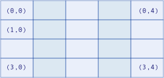

# Visual Basic 中的数组维数
[!INCLUDE[vs2017banner](../../../../visual-basic/includes/vs2017banner.md)]

*“维”*是一个方向，可以在此方向上改变数组元素的规范。  保存月内每日总销量的数组有一个维（当月日期）。  保存每个部门的月内每日总销量的数组有两个维（部门编号和当月日期）。  数组的维数称为数组的*“秩”*。  
  
> [!NOTE]
>  可以使用 <xref:System.Array.Rank%2A> 属性确定数组具有多少维。  
  
## 使用维  
 可以通过为数组的每一维提供*“索引”*或*“下标”*来指定数组元素。  在每一维中，元素都按照从索引 0 到该维的最大索引的顺序连续排列。  
  
 下面的插图演示具有不同秩的数组的概念性结构。  插图中的每个元素都显示访问该元素的索引值。  例如，指定索引 `(1, 0)` 可以访问二维数组第二行的第一个元素。  
  
   
一维数组  
  
   
二维数组  
  
   
三维数组  
  
### 一维  
 很多数组只有一维，如处在各个年龄的人数。  要指定某个元素，只需要该元素所保存的人数的年龄。  因此，这类数组只使用一个索引。  下面的示例声明一个变量来保存一个*“一维数组”*，其中包含从 0 岁到 120 岁之间每个年龄的人数。  
  
```  
Dim ageCounts(120) As UInteger  
```  
  
### 二维  
 某些数组有两个维，如校园内每座建筑物内每一楼层的办公室数量。  元素的规范需要建筑物编号和楼层，并且每个元素都根据建筑物和楼层的组合来保存办公室的数量。  因此，这类数组使用两个索引。  下面的示例声明一个变量来保存一个*“二维数组”*， 组元素是办公室的数量，建筑物从 0 到 40，楼层从 0 到 5。  
  
```  
Dim officeCounts(40, 5) As Byte  
```  
  
 二维数组也称为*“矩形数组”*。  
  
### 三维  
 有些数组有三个维，如三维空间中的值。  这类数组使用三个索引，在本例中，索引分别表示物理空间中的 x、y 和 z 坐标。  下面的示例声明一个变量来保存一个*“三维数组”*，元素为三维空间中不同点的气温。  
  
```  
Dim airTemperatures(99, 99, 24) As Single  
```  
  
### 多于三维  
 尽管数组可容纳多达 32 个维，但多于三维的情况并不多见。  
  
> [!NOTE]
>  增加一个数组的维数时，该数组所需的总存储空间会急剧增大，因此应慎用多维数组。  
  
## 使用不同维数  
 假设要跟踪当前月份每天的销售量。  可以声明一个具有 31 个元素的一维数组，每个元素对应于月中的每一天，如下例所示。  
  
```  
Dim salesAmounts(30) As Double  
```  
  
 现在假设不仅要跟踪一个月中每一天的同一信息，还要跟踪当年每个月中每一天的同一信息。  可以声明一个具有 12 行（表示月）和 31 列（表示日）的二维数组，如下例所示。  
  
```  
Dim salesAmounts(11, 30) As Double  
```  
  
 现在假设决定让数组保存多年的信息。  如果要跟踪 5 年的销售量，则可声明一个具有 5 层、12 行和 31 列的三维数组，如下例所示。  
  
```  
Dim salesAmounts(4, 11, 30) As Double  
```  
  
 注意，由于每个索引从 0 变化到其最大值，因此 `salesAmounts` 的每一维都声明为该维所需长度减一。  另请注意，每增加一维，数组的大小都会增加。  前面示例中的三个大小分别为 31、372 和 1,860 个元素。  
  
> [!NOTE]
>  不使用 `Dim` 或 `New` 子句也可以创建数组。  例如，可以调用 <xref:System.Array.CreateInstance%2A> 方法，或者由另一个组件将以此方式创建的数组传入代码。  这类数组可以具有非 0 下限。  任何情况下都可以使用 <xref:System.Array.GetLowerBound%2A> 方法或 `LBound` 函数来测试某个维的下限。  
  
## 请参阅  
 [数组](../../../../visual-basic/programming-guide/language-features/arrays/index.md)   
 [数组疑难解答](../../../../visual-basic/programming-guide/language-features/arrays/troubleshooting-arrays.md)