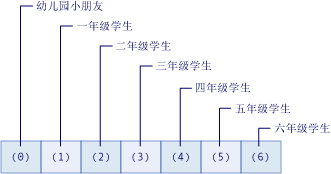

# <a name="arrays-in-visual-basic"></a>Visual Basic 中的数组
数组是一组在逻辑上彼此相关的值，如语法学校中每个年级学生的数量。  如果需要有关 Visual Basic for Applications (VBA) 中数组的帮助，请参阅[语言参考](https://msdn.microsoft.com/library/office/gg264383\(v=office.14\).aspx)。  
  
 通过使用数组，你可以按相同的名称引用这些相关的值，然后使用调用了索引或下标的数字来区分它们。 单个值称为数组的元素。 它们的索引值从 0 到最大值都是连续的。  
  
 与数组相反，包含单个值的变量称为 *“标量”* 变量。  
  
 在进行说明之前，请看几个简单的示例：  
  
```vb  
  
'Declare a single-dimension array of 5 values  
Dim numbers(4) As Integer   
  
‘Declare a single-dimension array and set array element values  
Dim numbers = New Integer() {1, 2, 4, 8}  
  
 ‘Redefine the size of an existing array retaining the current values  
ReDim Preserve numbers(15)  
  
 ‘Redefine the size of an existing array, resetting the values  
ReDim numbers(15)  
  
‘Declare a multi-dimensional array  
Dim matrix(5, 5) As Double  
  
‘Declare a multi-dimensional array and set array element values  
Dim matrix = New Integer(4, 4) {{1, 2}, {3, 4}, {5, 6}, {7, 8}}  
  
 ‘Declare a jagged array  
Dim sales()() As Double = New Double(11)() {}  
```  
  
 **主题内容**  
  
-   [简单数组中的数组元素](#BKMK_ArrayElements)  
  
-   [创建数组](#BKMK_CreatingAnArray)  
  
-   [在数组中存储值](#BKMK_StoringValues)  
  
-   [使用初始值填充数组](#BKMK_Populating)  
  
    -   [嵌套的数组文本](#BKMK_NestedArrayLiterals)  
  
-   [循环访问数组](#BKMK_Iterating)  
  
-   [作为返回值和参数的数组](#BKMK_ReturnValues)  
  
-   [交错数组](#BKMK_JaggedArrays)  
  
-   [零长度数组](#BKMK_ZeroLength)  
  
-   [数组大小](#BKMK_ArraySize)  
  
-   [数组类型和其他类型](#BKMK_ArrayTypes)  
  
-   [可替代数组的集合](#BKMK_Collections)  
  
##  <a name="BKMK_ArrayElements"></a>简单数组中的数组元素  
 下例声明了一个数组变量来表示语法学校每个年级的学生数。  
  
 [!code-vb[VbVbalrArrays#2](../../../../visual-basic/programming-guide/language-features/arrays/codesnippet/VisualBasic/index_1.vb)]  
  
 前面的示例中的数组 `students` 包含七个元素。 这些元素的索引范围为 0 到 6。 拥有此数组比声明七个变量更简单。  
  
 下图显示了数组 `students`。 对于数组的每个元素：  
  
-   元素索引表示年级（索引 0 表示幼儿园）。  
  
-   元素中包含的值表示每个年级的学生数量。  
  
   
“学生”数组中的元素  
  
 下面的示例演示了如何引用数组 `students`的第一、第二和最后一个元素。  
  
 [!code-vb[VbVbalrArrays#3](../../../../visual-basic/programming-guide/language-features/arrays/codesnippet/VisualBasic/index_2.vb)]  
  
 你可以通过使用不带索引的数组变量名称来引用作为一个整体的数组。  
  
 前面的示例中的数组 `students` 使用一个索引，则称其为一维。 使用多个索引或下标的数组则称为多维。 有关详细信息，请参阅此主题的剩余部分和 [Visual Basic 中的数组维度](../../../../visual-basic/programming-guide/language-features/arrays/array-dimensions.md)。  
  
##  <a name="BKMK_CreatingAnArray"></a>创建数组  
 你可以用几种方法定义数组的大小。 当声明数组时，你可以提供其大小，如以下示例所示。  
  
 [!code-vb[VbVbalrArrays#12](../../../../visual-basic/programming-guide/language-features/arrays/codesnippet/VisualBasic/index_3.vb)]  
  
 你还可以使用 `New` 子句提供数组大小，如以下示例所示。  
  
 [!code-vb[VbVbalrArrays#11](../../../../visual-basic/programming-guide/language-features/arrays/codesnippet/VisualBasic/index_4.vb)]  
  
 如果你具有现有数组，你可以通过使用 `Redim` 语句来重新定义其大小。 你可以指定 `Redim` 语句应保留的数组中的值，也可以指定它创建一个空数组。 下面的示例演示了用 `Redim` 语句来修改现有数组的大小的不同用法。  
  
 [!code-vb[VbVbalrArrays#13](../../../../visual-basic/programming-guide/language-features/arrays/codesnippet/VisualBasic/index_5.vb)]  
  
 有关详细信息，请参阅 [ReDim 语句](../../../../visual-basic/language-reference/statements/redim-statement.md)。  
  
##  <a name="BKMK_StoringValues"></a>在数组中存储值  
 你可以通过使用类型 `Integer`的索引访问数组中的每个位置。 你可以使用括号内的索引来引用每个数组位置，从而存储和检索数组中的值。 多维数组的索引用逗号 (,) 分隔。 每个数组维度都需要一个索引。 下例介绍了用于存储数组中的值的一些语句。  
  
 [!code-vb[VbVbalrArrays#5](../../../../visual-basic/programming-guide/language-features/arrays/codesnippet/VisualBasic/index_6.vb)]  
  
 下例介绍了用于获取数组中的值的一些语句。  
  
 [!code-vb[VbVbalrArrays#6](../../../../visual-basic/programming-guide/language-features/arrays/codesnippet/VisualBasic/index_7.vb)]  
  
##  <a name="BKMK_Populating"></a>使用初始值填充数组  
 通过使用数组文本，可以创建包含一组初始值的数组。 数组文本包含用逗号分隔的值列表，这些值被括在括号内 (`{}`)。  
  
 通过使用数组文本创建数组时，可以提供数组类型或使用类型推理功能来确定数组类型。 下面的代码演示了两种选项。  
  
 [!code-vb[VbVbalrCollectionInitializers#3](../../../../visual-basic/programming-guide/language-features/arrays/codesnippet/VisualBasic/index_8.vb)]  
  
 使用类型推理时，将根据为数组文本提供的值列表中的基准类型确定数组类型。 基准类型是数组文本中所有其他类型可以扩大到的唯一类型。 如果无法确定此唯一类型，基准类型是数组中所有其他类型可以缩小到的唯一类型。 如果无法确定为这两种唯一类型之一，则基准类型是 `Object`。 例如，如果提供给数组文本的值的列表包含 `Integer`、 `Long`和 `Double`类型的值，则生成的数组类型是 `Double`。 `Integer` 和 `Long` 都仅扩大到 `Double`。 因此， `Double` 是基准类型。 有关详细信息，请参阅[扩大和收缩转换](../../../../visual-basic/programming-guide/language-features/data-types/widening-and-narrowing-conversions.md)。 这些推理规则适用于为作为在类成员中定义的本地变量的数组所推理出来的类型。 虽然在创建类级别变量时可以使用数组文本，但你不能在类级别上使用类型推理。 因此，在类级别上指定的数组文本推理出作为类型 `Object`数组文本提供的值。  
  
 在使用数组文本创建的数组中，可以显式指定元素的类型。 在这种情况下，数组文本中的值必须扩大到数组的元素类型。 下面的代码示例从整数列表创建了一个 `Double` 类型的数组。  
  
 [!code-vb[VbVbalrCollectionInitializers#4](../../../../visual-basic/programming-guide/language-features/arrays/codesnippet/VisualBasic/index_9.vb)]  
  
###  <a name="BKMK_NestedArrayLiterals"></a>嵌套的数组文本  
 可以通过使用嵌套的数组文本创建多维数组。 嵌套的数组文本必须具有维度和维度数目或排名，这与生成的数组保持一致。 下面的代码示例通过使用数组文本创建了一个二维的整数数组。  
  
 [!code-vb[VbVbalrCollectionInitializers#7](../../../../visual-basic/programming-guide/language-features/arrays/codesnippet/VisualBasic/index_10.vb)]  
  
 在前面的示例中，如果嵌套的数组文本中的元素数目不匹配，则会出现错误。 如果显式声明的数组变量为非二维，也会出现错误。  
  
> [!NOTE]
>  你可以在提供不同维度的嵌套数组文本时，将内部数组文本括在括号内以避免出错。 圆括号会强制计算数组文字表达式，并将生成的值用于外部数组文本，如以下代码所示。  
  
 [!code-vb[VbVbalrCollectionInitializers#11](../../../../visual-basic/programming-guide/language-features/arrays/codesnippet/VisualBasic/index_11.vb)]  
  
 当你通过使用嵌套的数组文本创建多维数组时，可以使用类型推理。 当使用类型推理时，推理出的类型是用于嵌套级别的所有数组文本中的所有值的基准类型。 下面的代码示例从类型为 `Double` 和 `Integer` 的值中创建了一个类型为 `Double`的二维数组。  
  
 [!code-vb[VbVbalrCollectionInitializers#8](../../../../visual-basic/programming-guide/language-features/arrays/codesnippet/VisualBasic/index_12.vb)]  
  
 有关其他示例，请参阅[如何：在 Visual Basic 中初始化数组变量](../../../../visual-basic/programming-guide/language-features/arrays/how-to-initialize-an-array-variable.md)。  
  
##  <a name="BKMK_Iterating"></a>循环访问数组  
 循环访问数组时，你可以从最低到最高的索引访问数组中的每个元素。  
  
 下面的示例使用 [For...Next 语句](../../../../visual-basic/language-reference/statements/for-next-statement.md)循环访问一维数组。 <xref:System.Array.GetUpperBound%2A> 方法返回允许的索引最大值。 最小的索引值始终是 0。  
  
 [!code-vb[VbVbalrArrays#41](../../../../visual-basic/programming-guide/language-features/arrays/codesnippet/VisualBasic/index_13.vb)]  
  
 下面的示例使用 `For...Next` 语句循环访问一个多维数组。 <xref:System.Array.GetUpperBound%2A> 方法包含指定维度的参数。 `GetUpperBound(0)` 返回第一个维度的高索引值，`GetUpperBound(1)` 返回第二个维度的高索引值。  
  
 [!code-vb[VbVbalrArrays#42](../../../../visual-basic/programming-guide/language-features/arrays/codesnippet/VisualBasic/index_14.vb)]  
  
 下面的示例使用 [For Each...Next 语句](../../../../visual-basic/language-reference/statements/for-each-next-statement.md) 循环访问一维数组。  
  
 [!code-vb[VbVbalrArrays#43](../../../../visual-basic/programming-guide/language-features/arrays/codesnippet/VisualBasic/index_15.vb)]  
  
 下面的示例使用 `For Each...Next` 语句循环访问一个多维数组。 但是，如果使用一个嵌套的 `For…Next` 语句（如上例所示）而非一个 `For Each…Next` 语句，你能更好地控制多维数组中的元素。  
  
 [!code-vb[VbVbalrArrays#44](../../../../visual-basic/programming-guide/language-features/arrays/codesnippet/VisualBasic/index_16.vb)]  
  
##  <a name="BKMK_ReturnValues"></a>作为返回值和参数的数组  
 若要通过 `Function` 过程返回数组，请将数组数据类型和维度数指定为 [Function 语句](../../../../visual-basic/language-reference/statements/function-statement.md)的返回类型。 在函数内，声明一个具有相同数据类型和维度数的本地数组变量。 在 [Return 语句](../../../../visual-basic/language-reference/statements/return-statement.md)中，添加不带括号的局部数组变量。  
  
 若要将作为参数的数组指定到 `Sub` 或 `Function` 步骤中，可将此参数定义为具有指定数据类型和维度数量的数组。 在对过程的调用中，发送一个具有相同数据类型和维度数量的数组变量。  
  
 在下面的示例中， `GetNumbers` 函数将返回 `Integer()`。 此数组类型是一个类型为 `Integer`的一维数组。 `ShowNumbers` 过程接受 `Integer()` 参数。  
  
 [!code-vb[VbVbalrArrays#51](../../../../visual-basic/programming-guide/language-features/arrays/codesnippet/VisualBasic/index_17.vb)]  
  
 在下面的示例中， `GetNumbersMultiDim` 函数将返回 `Integer(,)`。 此数组类型是一个类型为 `Integer`的二维数组。  `ShowNumbersMultiDim` 过程接受 `Integer(,)` 参数。  
  
 [!code-vb[VbVbalrArrays#52](../../../../visual-basic/programming-guide/language-features/arrays/codesnippet/VisualBasic/index_18.vb)]  
  
##  <a name="BKMK_JaggedArrays"></a>交错数组  
 保留其他数组作为元素的数组被称为数组的数组或交错数组。 交错数组和交错数组中的每个元素都可以具有一个或多个维度。 有时应用程序中的数据结构是二维而不是矩形。  
  
 下面的示例是月份数组，其中每个元素是天数数组。 由于不同的月份具有的天数也不同，因此元素不构成矩形二维数组。 因此，使用交错数组而不是多维数组。  
  
 [!code-vb[VbVbalrArrays#21](../../../../visual-basic/programming-guide/language-features/arrays/codesnippet/VisualBasic/index_19.vb)]  
  
##  <a name="BKMK_ZeroLength"></a>零长度数组  
 不包含任何元素的数组也称为零长度数组。 保留零长度数组的变量不具有值 `Nothing`。 若要创建一个不包含任何元素的数组，可声明数组的维度之一为 -1，如以下示例所示。  
  
 [!code-vb[VbVbalrArrays#14](../../../../visual-basic/programming-guide/language-features/arrays/codesnippet/VisualBasic/index_20.vb)]  
  
 在下列情况下，你可能需要创建一个零长度数组：  
  
-   若要消除 <xref:System.NullReferenceException> 异常抛出的风险，代码必须访问 <xref:System.Array> 类的成员（如 <xref:System.Array.Length%2A> 或 <xref:System.Array.Rank%2A>），或调用 [!INCLUDE[vbprvb](../../../../csharp/programming-guide/concepts/linq/includes/vbprvb_md.md)] 函数（如 <xref:Microsoft.VisualBasic.Information.UBound%2A>）。  
  
-   你想通过无需将 `Nothing` 作为特殊情况检查而使得使用的代码更简单。  
  
-   你的代码与应用程序编程接口 (API) 交互，该接口要求你将一个零长度数组传递到一个或多个过程，或将一个零长度数组返回到一个或多个过程。  
  
##  <a name="BKMK_ArraySize"></a>数组大小  
 数组的大小是数组所有维度的长度的产物。 它表示数组中当前所包含的元素总数。  
  
 下面的示例声明了一个三维数组。  
  
```  
Dim prices(3, 4, 5) As Long  
```  
  
 变量 `prices` 中数组的总大小为 (3 + 1) x (4 + 1) x (5 + 1) = 120。  
  
 可以使用 <xref:System.Array.Length%2A> 属性查找数组大小。 可以使用 <xref:System.Array.GetLength%2A> 方法查找多维数组的每个维度的长度。  
  
 可以通过向数组变量分配新数组对象或使用 `ReDim` 语句来调整它的大小。  
  
 当处理数组大小时，需要记住几件事情。  
  
|||  
|---|---|  
|维度长度|每个维度的索引都是从 0 开始，这意味着它的范围介于 0 到其上限之间。 因此，给定维度的长度比该维度已声明的上限大 1。|  
|长度限制|数组的每个维度的长度不能超过 `Integer` 数据类型的最大值，即 (2 ^ 31) - 1。 但是，数组的总大小还受到系统上可用的内存限制。 如果尝试初始化超过了可用 RAM 量的数组，那么公共语言运行时会抛出 <xref:System.OutOfMemoryException> 异常。|  
|大小和元素大小|数组的大小独立于其元素的数据类型。 大小始终表示元素总数，而不是所占用的存储的字节数。|  
|内存消耗|做出关于数组如何存储在内存中的假设是不可靠的。 由于不同数据宽度的平台上的存储会有所变化，因此同一数组在 64 位系统上可以占用比在 32 位系统上更多的内存。 具体取决于数组初始化时的系统配置，公共语言运行时 (CLR) 可以尽可能地将存储分配到靠近包元素的地方，或者将它们全部在自然硬件边界上对齐。 此外，数组需要存储开销的控制信息，而且每添加一个维度，这种开销随之增加。|  
  
##  <a name="BKMK_ArrayTypes"></a>数组类型和其他类型  
 每个数组都具有一个数据类型，但不同于它的元素的数据类型。 没有一种数据类型能用于所有数组。 相反，数组的数据类型由数组的维度数量或 *“排名”*，以及数组中元素的数据类型确定。 仅当两个数组变量具有相同的排名且它们的元素具有相同的数据类型时，它们才被视为具有相同的数据类型。 数组中维度长度不会影响数组数据类型。  
  
 每个数组都继承自 <xref:System.Array?displayProperty=fullName> 类，可以声明类型为 `Array` 的变量，但不能创建类型为 `Array` 的数组。 此外，[ReDim 语句](../../../../visual-basic/language-reference/statements/redim-statement.md)无法对声明为类型 `Array` 的变量执行运算。 出于这些原因，以及为类型安全考虑，最好将每个数组声明为特定类型，例如前面示例中的 `Integer` 。  
  
 你可以通过几种方式了解到数组及其元素的数据类型。  
  
-   可以在变量中调用 <xref:System.Object.GetType%2A?displayProperty=fullName> 方法，以接收此变量的运行时类型 <xref:System.Type> 对象。 <xref:System.Type> 对象的属性和方法中可保留大量信息。  
  
-   可以将变量传递给 <xref:Microsoft.VisualBasic.Information.TypeName%2A> 函数，以接收包含运行时类型名称的 `String`。  
  
-   可以将变量传递给 <xref:Microsoft.VisualBasic.Information.VarType%2A> 函数，以接收表示变量的类型分类的 `VariantType` 值。  
  
 下面的示例调用 `TypeName` 函数来确定数组的类型和数组中元素的类型。 数组类型是 `Integer(,)` 而数组中的元素的类型是 `Integer`。  
  
 [!code-vb[VbVbalrArrays#15](../../../../visual-basic/programming-guide/language-features/arrays/codesnippet/VisualBasic/index_21.vb)]  
  
##  <a name="BKMK_Collections"></a>替代数组的集合  
 数组最适用于创建和使用固定数量的强类型化对象。 集合提供更灵活的方式来使用对象组。 与数组不同，你使用的对象组会随着应用程序更改的需要动态地放大和缩小。  
  
 如果需要更改数组大小，必须使用 [ReDim 语句](../../../../visual-basic/language-reference/statements/redim-statement.md)。 当你这样做时，[!INCLUDE[vbprvb](../../../../csharp/programming-guide/concepts/linq/includes/vbprvb_md.md)] 会新建一个数组，并释放旧数组以供处置。 这需要执行时间。 因此，如果你正在使用的项目数量频繁变化，或者你无法预测你所需的最大项目数量，使用集合也许能够获得更好的性能。  
  
 对于某些集合，你可以为放入集合中的任何对象分配一个密钥，这样你便可以使用该密钥快速检索此对象。  
  
 如果集合中只包含一种数据类型的元素，可以使用 <xref:System.Collections.Generic?displayProperty=fullName> 命名空间中的一个类。 泛型集合强制类型安全，因此无法向其添加任何其他数据类型。 当你从泛型集合检索元素时，你无需确定其数据类型或对其进行转换。  
  
 有关集合的详细信息，请参阅[集合](http://msdn.microsoft.com/library/e76533a9-5033-4a0b-b003-9c2be60d185b)。  
  
### <a name="example"></a>示例  
 下面的示例使用 [!INCLUDE[dnprdnshort](../../../../csharp/getting-started/includes/dnprdnshort_md.md)] 泛型类 <xref:System.Collections.Generic.List%601?displayProperty=fullName> 创建 `Customer` 对象的列表集合。  
  
 [!code-vb[VbVbalrArrays#1](../../../../visual-basic/programming-guide/language-features/arrays/codesnippet/VisualBasic/index_22.vb)]  
  
 `CustomerFile` 集合的声明指示，它仅可以包含类型为 `Customer`的元素。 它还提供了大小为 200 个元素的初始容量。 过程 `AddNewCustomer` 检查新元素的有效性，然后将其添加到集合。 过程 `PrintCustomers` 使用 `For Each` 循环来遍历该集合并显示其元素。  
  
## <a name="related-topics"></a>相关主题  
  
|术语|定义|  
|----------|----------------|  
|[Visual Basic 中的数组维度](../../../../visual-basic/programming-guide/language-features/arrays/array-dimensions.md)|在数组中解释级别和维度。|  
|[如何：在 Visual Basic 中初始化数组变量](../../../../visual-basic/programming-guide/language-features/arrays/how-to-initialize-an-array-variable.md)|说明如何用初始值填充数组。|  
|[如何：在 Visual Basic 中对数组进行排序](../../../../visual-basic/programming-guide/language-features/arrays/how-to-sort-an-array.md)|显示如何按字母先后顺序对数组元素进行排序。|  
|[如何：将一个数组赋给另一个数组](../../../../visual-basic/programming-guide/language-features/arrays/how-to-assign-one-array-to-another-array.md)|说明将数组分配到另一个数组变量的规则和步骤。|  
|[数组疑难解答](../../../../visual-basic/programming-guide/language-features/arrays/troubleshooting-arrays.md)|讨论在使用数组时出现的一些常见问题。|  
  
## <a name="see-also"></a>另请参阅  
 <xref:System.Array>   
 [Dim 语句](../../../../visual-basic/language-reference/statements/dim-statement.md)   
 [ReDim 语句](../../../../visual-basic/language-reference/statements/redim-statement.md)
