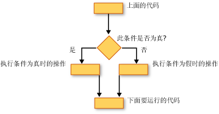

# 决策结构 (Visual Basic)
[!INCLUDE[vbprvb](../../../../csharp/programming-guide/concepts/linq/includes/vbprvb_md.md)]允许您测试条件，然后执行不同的操作，具体取决于该测试的结果。 您可以测试条件是 true 还是 false，各种值的表达式或生成时执行一系列语句的各种异常。  
  
 下图显示的决策结构，将测试条件是，则返回 true 并采取不同的操作，具体取决于它是 true 还是 false。  
  
   
条件为 true，为 false 时采用不同的操作  
  
## 如果...然后...其他构造  
 `If...Then...Else`构造，可以测试一个或多个条件，然后运行具体取决于每个条件的一个或多个语句。 您可以测试条件，然后按以下方式执行操作︰  
  
-   如果条件为，运行一个或多个语句`True`  
  
-   如果条件为，运行一个或多个语句`False`  
  
-   如果条件为运行某些语句`True`和其他人是否`False`  
  
-   如果前一个条件是，测试的附加条件`False`  
  
 提供所有这些可能性的控制结构[如果...然后...Else 语句](../../../../visual-basic/language-reference/statements/if-then-else-statement.md)。 如果你有只需一个测试和要运行的一个语句，可以使用单行版本。 如果您有一组更复杂的条件和操作，您可以使用多个行版本。  
  
## 选择...Case 构造  
 `Select...Case`构造，可以计算一次表达式，然后运行组不同的基于不同的可能值的语句。 有关详细信息，请参阅[选择...Case 语句](../../../../visual-basic/language-reference/statements/select-case-statement.md)。  
  
## 重试...Catch...最后构造  
 `Try...Catch...Finally`构造，可以运行的一组下的环境中，一直保留控件，如果您的语句的任何一个导致异常的语句。 您可以采取不同的操作为不同的异常。 您可以选择指定的前退出整个运行的代码块`Try...Catch...Finally`构造，而不考虑所发生的情况。 有关详细信息，请参阅[重试...Catch...Finally 语句](../../../../visual-basic/language-reference/statements/try-catch-finally-statement.md)。  
  
> [!NOTE]
>  对于许多控制结构，当您单击某个关键字在结构中的关键字的所有都会突出显示。 例如，当您单击`If`中`If...Then...Else`构造、 的所有实例`If`， `Then`， `ElseIf`， `Else`，和`End If`在构造过程中会突出显示。 若要将移动到下一步或上一个突出显示关键字，按 CTRL + SHIFT + 向下键或 CTRL + SHIFT + 向上键。  
  
## 另请参阅  
 [控制流](../../../../visual-basic/programming-guide/language-features/control-flow/index.md)   
 [循环结构](../../../../visual-basic/programming-guide/language-features/control-flow/loop-structures.md)   
 [其他控件结构](../../../../visual-basic/programming-guide/language-features/control-flow/other-control-structures.md)   
 [嵌套的控件结构](../../../../visual-basic/programming-guide/language-features/control-flow/nested-control-structures.md)   
 [If 运算符](../../../../visual-basic/language-reference/operators/if-operator.md)
