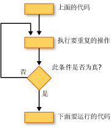

# 循环结构 (Visual Basic)
[!INCLUDE[vbprvb](../../../../csharp/programming-guide/concepts/linq/includes/vbprvb_md.md)]循环结构允许您重复运行的代码的一个或多个行。 您可以重复循环结构中的语句，直到条件为`True`，直到条件为`False`、 在集合中指定的次数，或者一次为每个元素。  
  
 下图显示运行的一组语句，直到条件变为真后在循环结构。  
  
   
运行一组语句，直到条件变为 true  
  
## While 循环  
 The `While`...`End While`构造，只要中指定的条件运行的一组语句`While`语句是`True`。 有关详细信息，请参阅[时...While 语句结束](../../../../visual-basic/language-reference/statements/while-end-while-statement.md)。  
  
## Do 循环  
 The `Do`...`Loop`构造允许您开头或末尾循环结构对条件进行测试。 您还可以指定是否在条件时重复循环`True`或直到它成为`True`。 有关详细信息，请参阅[做...循环语句](../../../../visual-basic/language-reference/statements/do-loop-statement.md)。  
  
## For 循环  
 The `For`...`Next`构造执行循环次数。 它使用循环控制变量，也称为*计数器*，若要跟踪的重复。 指定的开始和结束此计数器的数值，您可以选择指定的量递增一次重复从下一步。 有关详细信息，请参阅[为...下一条语句](../../../../visual-basic/language-reference/statements/for-next-statement.md)。  
  
## For Each 循环  
 The `For Each`...`Next`构造为集合中运行的一组对于每个元素执行一次的语句。 指定循环控制变量，但不是需要确定启动或终止值。 有关详细信息，请参阅[为每个...下一条语句](../../../../visual-basic/language-reference/statements/for-each-next-statement.md)。  
  
## 另请参阅  
 [控制流](../../../../visual-basic/programming-guide/language-features/control-flow/index.md)   
 [决策结构](../../../../visual-basic/programming-guide/language-features/control-flow/decision-structures.md)   
 [其他控件结构](../../../../visual-basic/programming-guide/language-features/control-flow/other-control-structures.md)   
 [嵌套的控件结构](../../../../visual-basic/programming-guide/language-features/control-flow/nested-control-structures.md)
