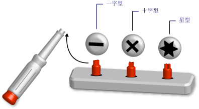

# Visual Basic 中的泛型类型 (Visual Basic)
*泛型类型* 是可适应对多种数据类型执行相同功能的单个编程元素。 定义泛型类或过程时，无需为可能需要对其执行该功能的每个数据类型定义单独版本。  
  
 就好比是带有可拆卸刀头的螺丝刀。 你检查需要拧动的螺丝，然后选择适合该螺丝的刀头（一字、十字、星形）。 将正确的刀头插入到螺丝刀柄上后，你就可以使用螺丝刀执行完全相同的功能，即拧螺丝。  
  
   
作为通用工具的螺丝刀  
  
 定义泛型类型时，即使用一个或多个数据类型将其参数化。 这样可允许使用代码定制数据类型以满足其要求。 代码可以通过泛型元素声明若干个不同的编程元素，每个元素可使用一组不同的数据类型。 但是，无论声明的元素使用哪些数据类型，它们均执行相同的逻辑。  
  
 例如，你可能想创建并使用一个处理特定数据类型（例如 `String`）的队列类。 您可以声明这样的类从<xref:System.Collections.Generic.Queue%601?displayProperty=fullName>，如下面的示例所示。</xref:System.Collections.Generic.Queue%601?displayProperty=fullName>  
  
 [!code-vb[VbVbalrDataTypes #&1;](../../../../visual-basic/language-reference/data-types/codesnippet/VisualBasic/generic-types_1.vb)]  
  
 现在，可以使用 `stringQ` 来专门处理 `String` 值。 由于 `stringQ` 专用于 `String` 而未针对 `Object` 值进行泛型化，因此，不会有晚期绑定或类型转换。 从而节省了执行时间并减少了运行时错误。  
  
 使用泛型类型的详细信息，请参阅[如何︰ 使用泛型类](../../../../visual-basic/programming-guide/language-features/data-types/how-to-use-a-generic-class.md)。  
  
## 泛型类的示例。  
 下面的示例演示了泛型类的主干定义。  
  
 [!code-vb[VbVbalrDataTypes #&2;](../../../../visual-basic/language-reference/data-types/codesnippet/VisualBasic/generic-types_2.vb)]  
  
 在上面的主干中， `t` 是一个 *类型形参*，即你在声明此类时提供的数据类型的占位符。 在代码中的其他地方，可以通过为 `classHolder` 提供不同的数据类型来声明不同版本的 `t` 下面的示例演示了两个此类声明。  
  
 [!code-vb[VbVbalrDataTypes #&3;](../../../../visual-basic/language-reference/data-types/codesnippet/VisualBasic/generic-types_3.vb)]  
  
 上面的语句声明了 *构造类*，在这些类中，特定的类型替换了类型形参。 此类替换会在构造类中的代码内进行传播。 下面的示例显示了 `processNewItem` 过程在 `integerClass`中的外观。  
  
 [!code-vb[VbVbalrDataTypes #&4;](../../../../visual-basic/language-reference/data-types/codesnippet/VisualBasic/generic-types_4.vb)]  
  
 有关更完整的示例，请参阅[如何︰ 定义类，可以提供具有相同的功能对不同数据类型](../../../../visual-basic/programming-guide/language-features/data-types/how-to-define-a-class-that-can-provide-identical-functionality.md)。  
  
## 合格的编程元素  
 你可以定义并使用泛型类、结构、接口、过程和委托。 请注意，[!INCLUDE[dnprdnshort](../../../../csharp/getting-started/includes/dnprdnshort_md.md)]定义多个泛型类、 结构和接口，用于表示常用泛型元素。 <xref:System.Collections.Generic?displayProperty=fullName>命名空间提供词典、 列表、 队列和堆栈。</xref:System.Collections.Generic?displayProperty=fullName> 在定义您自己的泛型元素之前, 查看它是否已可在<xref:System.Collections.Generic?displayProperty=fullName>。</xref:System.Collections.Generic?displayProperty=fullName>  
  
 过程不是类型，但可以定义并使用泛型过程。 请参阅[Visual Basic 中的泛型过程](../../../../visual-basic/programming-guide/language-features/data-types/generic-procedures.md)。  
  
## 泛型类型的优点  
 泛型类型用作声明几个不同编程元素的基础，而每个元素均处理特定的数据类型。 泛型类型的替代项有：  
  
1.  对 `Object` 数据类型进行处理的单一类型。  
  
2.  一组 *特定于类型* 的类型版本，每个版本单独进行编码并处理一种特定的数据类型（如 `String`、 `Integer`）或用户定义的类型（如 `customer`）。  
  
 与上述替代项相比，泛型类型具有以下优点：  
  
-   **类型安全。** 泛型类型强制实施编译时类型检查。 而基于 `Object` 的类型可接受任何数据类型，因此，你必须编写代码以检查是否可接受某种输入数据类型。 通过泛型类型，编译器可以在运行时之前捕获类型的不匹配。  
  
-   **性能。** 泛型类型无需对数据进行 *装箱* 和 *un装箱* 操作，原因是每种泛型类型均专用于一种数据类型。 而基于 `Object` 的操作必须将输入数据类型进行装箱，以将它们转换为 `Object` ，而且还将对预定输出的数据进行取消装箱操作。 装箱和取消装箱操作会降低性能。  
  
     此外，还要对基于 `Object` 的类型进行晚期绑定，这意味着需要编写额外的代码才能在运行时访问它们的成员。 这同样会降低性能。  
  
-   **代码合并。** 只能对泛型类型中的代码定义一次。 而一组特定于类型的类型版本必须在每个版本中复制相同的代码，唯一的不同就是该版本的特定数据类型。 利用泛型类型，特定于类型的版本全都利用原始的泛型类型生成。  
  
-   **代码重用。** 对于不依赖特定数据类型的泛型代码，可以利用不同的数据类型重用它。 你可以经常重用此类代码（甚至利用最初未预料到的数据类型来重用它）。  
  
-   **IDE 的支持。** 在使用通过泛型类型声明的构造类型时，集成开发环境 (IDE) 可以在你开发代码时给予更多的支持。 例如，IntelliSense 可以显示适用于构造函数或方法的某个参数的特定于类型的选项。  
  
-   **泛型算法。** 独立于类型的抽象算法非常适用于泛型类型。 例如，使用的<xref:System.IComparable>接口可以用于实现<xref:System.IComparable>。</xref:System.IComparable>任何数据类型</xref:System.IComparable>的项进行排序的泛型过程  
  
## 约束  
 虽然泛型类型定义中的代码应尽可能独立于类型，但你可能需要要求向泛型类型提供任何数据类型的某项功能。 例如，如果您想要比较两个项，以便在进行排序和排序规则，其数据类型必须实现<xref:System.IComparable>接口。</xref:System.IComparable> 可通过向类型形参添加 *约束* 来强制实施此要求。  
  
### 约束的示例  
 下面的示例演示具有需要实现<xref:System.IComparable>。</xref:System.IComparable>让类型参数的约束的类的主干定义  
  
 [!code-vb[VbVbalrDataTypes #&5;](../../../../visual-basic/language-reference/data-types/codesnippet/VisualBasic/generic-types_5.vb)]  
  
 如果后面的代码尝试构造一个类从`itemManager`提供了一个类型不实现<xref:System.IComparable>，编译器会引发错误。</xref:System.IComparable>  
  
### 约束的类型  
 约束可以按任意组合指定下列要求：  
  
-   该类型实参必须实现一个或多个接口  
  
-   类型实参至多只能是一个类的类型，或至多只能从一个类继承  
  
-   对于通过类型实参创建对象的代码，类型实参必须公开一个可供其访问的无参数构造函数  
  
-   类型实参必须是 *引用类型*或 *值类型*  
  
 如果需要强制实施多个要求，则可以使用以逗号分隔的 *约束列表* （括在大括号 (`{ }`) 内）。 若要需要可访问构造函数，则包含[New 运算符](../../../../visual-basic/language-reference/operators/new-operator.md)列表中的关键字。 若需要引用类型，请加入 `Class` 关键字；若需要值类型，请加入 `Structure` 关键字。  
  
 有关约束的详细信息，请参阅[类型列表](../../../../visual-basic/language-reference/statements/type-list.md)。  
  
### 多个约束的示例  
 下面的示例演示了带有类型形参约束列表的泛型类的主干定义。 在代码中创建此类的实例，类型参数必须同时实现<xref:System.IComparable>和<xref:System.IDisposable>接口，是引用类型，并公开访问的无参数构造函数。</xref:System.IDisposable> </xref:System.IComparable>  
  
 [!code-vb[VbVbalrDataTypes #&6;](../../../../visual-basic/language-reference/data-types/codesnippet/VisualBasic/generic-types_6.vb)]  
  
## 重要术语  
 泛型类型引入并使用了以下术语：  
  
-   *泛型类型*。 类、结构、接口、过程或委托的定义，在声明它们时要为它们提供至少一种数据类型。  
  
-   *类型形参*。 在泛型类型定义中，你在声明数据类型时为其提供的占位符。  
  
-   *类型实参*。 一种特定的数据类型，用于在你通过泛型类型声明构造类型时替换类型形参。  
  
-   *约束*。 关于类型形参的条件，用于限制可以为类型形参提供的类型实参。 约束可以要求类型实参必须实现特定接口，必须是特定的类或继承自特定的类，必须具有可访问的无参数构造函数，或者必须是引用类型或值类型。 你可以组合这些约束，但至多只能指定一个类。  
  
-   *构造类型*。 通过为泛型类型的类型形参提供类型实参，从泛型类型声明的类、结构、接口、过程或委托。  
  
## 请参见  
 [数据类型](../../../../visual-basic/programming-guide/language-features/data-types/index.md)   
 [类型字符](../../../../visual-basic/programming-guide/language-features/data-types/type-characters.md)   
 [值类型和引用类型](../../../../visual-basic/programming-guide/language-features/data-types/value-types-and-reference-types.md)   
 [在 Visual Basic 中的类型转换](../../../../visual-basic/programming-guide/language-features/data-types/type-conversions.md)   
 [数据类型疑难解答](../../../../visual-basic/programming-guide/language-features/data-types/troubleshooting-data-types.md)   
 [数据类型](../../../../visual-basic/language-reference/data-types/data-type-summary.md)   
 [Of](../../../../visual-basic/language-reference/statements/of-clause.md)   
 [作为](../../../../visual-basic/language-reference/statements/as-clause.md)   
 [Object 数据类型](../../../../visual-basic/language-reference/data-types/object-data-type.md)   
 [协变和逆变](http://msdn.microsoft.com/library/a58cc086-276f-4f91-a366-85b7f95f38b8)   
 [迭代器](http://msdn.microsoft.com/library/f45331db-d595-46ec-9142-551d3d1eb1a7)
