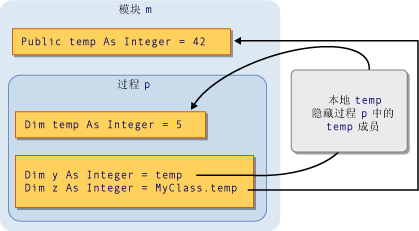
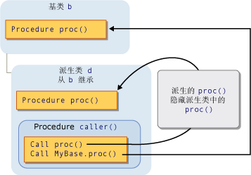

# <a name="shadowing-in-visual-basic"></a>Visual Basic 中的隐藏
当两个编程元素共享相同的名称时，可以隐藏其中之一，或*阴影*，另一个。 在这种情况下，隐藏的元素不是供用户参考;相反，当您的代码使用元素名称、[!INCLUDE[vbprvb](../../../../csharp/programming-guide/concepts/linq/includes/vbprvb_md.md)]编译器将其解析为隐藏元素。  
  
## <a name="purpose"></a>用途  
 隐藏的主要目的是保护类成员的定义。 基类可能会经历创建具有作为一个已定义的相同名称的元素的更改。 如果发生这种情况，`Shadows`通过您的类将解析为该成员的修饰符强制引用您定义，而不是到新的基类元素。  
  
## <a name="types-of-shadowing"></a>隐藏类型  
 元素可以在两种不同方式隐藏另一个元素。 隐藏的元素可以声明包含隐藏的元素中这, 种情况下隐藏来实现的区域的子区域内*通过范围*。 派生类可以定义一个基类，这种情况下隐藏来完成的成员或者*通过继承*。  
  
### <a name="shadowing-through-scope"></a>通过范围进行隐藏  
 很可能相同的模块、 类或结构为具有相同名称但不同的作用域中的编程元素。 范围较窄的元素后，在这种方式中声明两个元素的代码引用它们共享的名称，隐藏的其他元素 （块范围是最小）。  
  
 例如，可以定义一个模块`Public`变量名为`temp`，而该模块内的一个过程可以声明也名为的本地变量`temp`。 对引用`temp`从过程来访问局部变量，而对引用`temp`从外部过程访问`Public`变量。 在此情况下，过程变量`temp`隐藏模块变量`temp`。  
  
 下图显示了两个变量，名为`temp`。 本地变量`temp`隐藏了成员变量`temp`时从其自己的程序内访问`p`。 但是，`MyClass`关键字绕开隐藏并访问的成员变量。  
  
   
通过范围进行隐藏  
  
 通过范围进行隐藏的示例，请参阅[如何︰ 隐藏与您的变量同名的变量](../../../../visual-basic/programming-guide/language-features/declared-elements/how-to-hide-a-variable-with-the-same-name-as-your-variable.md)。  
  
### <a name="shadowing-through-inheritance"></a>通过继承进行隐藏  
 如果派生的类重定义继承自基类的类的编程元素，重新定义的元素将隐藏原始元素。 与任何其他类型都可隐藏任何类型的已声明的元素或重载元素集。 例如，`Integer`变量可以隐藏`Function`过程。 如果隐藏与另一个过程的过程，您可以使用不同的参数列表和不同的返回类型。  
  
 下图显示了一个基类`b`和派生的类`d`，该类继承自`b`。 该基类定义一个名为过程`proc`，然后用相同名称的另一个过程的派生的类隐藏它。 第一个`Call`语句访问该隐藏`proc`在派生类中。 但是，`MyBase`关键字绕开隐藏并访问基类中隐藏的过程。  
  
   
通过继承进行隐藏  
  
 通过继承隐藏的示例，请参阅[如何︰ 隐藏与您的变量同名的变量](../../../../visual-basic/programming-guide/language-features/declared-elements/how-to-hide-a-variable-with-the-same-name-as-your-variable.md)和[如何︰ 隐藏继承变量](../../../../visual-basic/programming-guide/language-features/declared-elements/how-to-hide-an-inherited-variable.md)。  
  
#### <a name="shadowing-and-access-level"></a>隐藏和访问级别  
 隐藏元素并不总是可以从使用派生的类的代码访问。 例如，可能会声明`Private`。 在这种情况下，隐藏的比较是失效，编译器将任何引用的同一个元素，它必须解析如果没有过没有隐藏。 此元素是可访问的元素最少派生自隐藏类向后步骤。 如果被隐藏的元素是一个过程，分辨率为最接近的可访问版本具有相同名称参数列表中，并返回类型。  
  
 下面的示例演示三个类的继承层次结构。 每个类定义`Sub`过程`display`，并且每个派生类都隐藏`display`其基类中的过程。  
  
```  
Public Class firstClass  
    Public Sub display()  
        MsgBox("This is firstClass")  
    End Sub  
End Class  
Public Class secondClass  
    Inherits firstClass  
    Private Shadows Sub display()  
        MsgBox("This is secondClass")  
    End Sub  
End Class  
Public Class thirdClass  
    Inherits secondClass  
    Public Shadows Sub display()  
        MsgBox("This is thirdClass")  
    End Sub  
End Class  
Module callDisplay  
    Dim first As New firstClass  
    Dim second As New secondClass  
    Dim third As New thirdClass  
    Public Sub callDisplayProcedures()  
        ' The following statement displays "This is firstClass".  
        first.display()  
        ' The following statement displays "This is firstClass".  
        second.display()  
        ' The following statement displays "This is thirdClass".  
        third.display()  
    End Sub  
End Module  
```  
  
 在前面的示例中，派生类`secondClass`阴影`display`与`Private`过程。 当模块`callDisplay`调用`display`中`secondClass`，调用代码之外，则`secondClass`，因此不能访问私有`display`过程。 隐藏失败，并且编译器将对基类的引用解析`display`过程。  
  
 但是，进一步派生类`thirdClass`声明`display`作为`Public`，因此中的代码`callDisplay`可以访问它。  
  
## <a name="shadowing-and-overriding"></a>隐藏和重写  
 不要混淆隐藏和重写。 在派生的类继承自基类，并同时重新定义与另一个已声明的元素时，将使用它们。 但是，这两者之间的重大差异。 有关比较，请参阅[之间隐藏之间的差异和覆盖](../../../../visual-basic/programming-guide/language-features/declared-elements/differences-between-shadowing-and-overriding.md)。  
  
## <a name="shadowing-and-overloading"></a>隐藏和重载  
 如果在派生类中隐藏了多个元素具有的相同基类元素，隐藏的元素将变为该元素的重载的版本。 有关详细信息，请参阅[过程重载](../../../../visual-basic/programming-guide/language-features/procedures/procedure-overloading.md)。  
  
## <a name="accessing-a-shadowed-element"></a>访问隐藏的元素  
 当从派生类访问一个元素时，您通常要通过该派生类的当前实例的限定元素名与`Me`关键字。 如果在派生的类隐藏基类中的元素，则可以通过限定其与访问基类元素`MyBase`关键字。  
  
 访问隐藏的元素的示例，请参阅[如何︰ 访问被派生类变量隐藏](../../../../visual-basic/programming-guide/language-features/declared-elements/how-to-access-a-variable-hidden-by-a-derived-class.md)。  
  
### <a name="declaration-of-the-object-variable"></a>对象变量的声明  
 如何创建对象变量也会影响是否派生的类是访问隐藏的元素还是被隐藏的元素。 下面的示例创建两个对象从派生类中，但一个对象声明为类的基类，另一个用作派生的类。  
  
```  
Public Class baseCls  
    ' The following statement declares the element that is to be shadowed.  
    Public z As Integer = 100  
End Class  
Public Class dervCls  
    Inherits baseCls  
    ' The following statement declares the shadowing element.  
    Public Shadows z As String = "*"  
End Class  
Public Class useClasses  
    ' The following statement creates the object declared as the base class.  
    Dim basObj As baseCls = New dervCls()  
    ' Note that dervCls widens to its base class baseCls.  
    ' The following statement creates the object declared as the derived class.  
    Dim derObj As dervCls = New dervCls()  
    Public Sub showZ()   
    ' The following statement outputs 100 (the shadowed element).  
        MsgBox("Accessed through base class: " & basObj.z)  
    ' The following statement outputs "*" (the shadowing element).  
        MsgBox("Accessed through derived class: " & derObj.z)  
    End Sub  
End Class  
```  
  
 在前面的示例中，该变量`basObj`被声明为类的基类。 分配`dervCls`对象传递给它构成了扩大转换，因此有效。 但是，基类不能访问该变量的隐藏版本`z`在派生类中，因此编译器会将解析`basObj.z`为基类初始值。  
  
## <a name="see-also"></a>另请参阅  
 [对已声明的元素的引用](../../../../visual-basic/programming-guide/language-features/declared-elements/references-to-declared-elements.md)   
 [在 Visual Basic 中的作用域](../../../../visual-basic/programming-guide/language-features/declared-elements/scope.md)   
 [扩大转换和收缩转换](../../../../visual-basic/programming-guide/language-features/data-types/widening-and-narrowing-conversions.md)   
 [阴影](../../../../visual-basic/language-reference/modifiers/shadows.md)   
 [重写](../../../../visual-basic/language-reference/modifiers/overrides.md)   
 [Me、 My、 MyBase 和 MyClass](../../../../visual-basic/programming-guide/program-structure/me-my-mybase-and-myclass.md)   
 [继承的基础知识](../../../../visual-basic/programming-guide/language-features/objects-and-classes/inheritance-basics.md)
