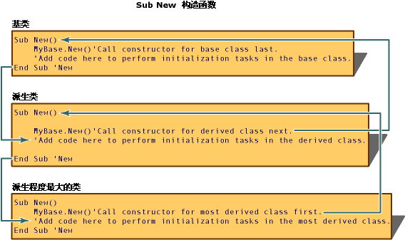

# <a name="object-lifetime-how-objects-are-created-and-destroyed-visual-basic"></a>对象生存期：如何创建和销毁对象 (Visual Basic)
使用 `New` 关键字创建类的实例（即对象）。 通常，初始化任务必须在使用之前在新对象上执行。 常见的初始化任务包括打开文件、连接到数据库以及读取注册表项的值。 Visual Basic 控制的使用过程调用的新对象的初始化*构造函数*（允许控制初始化的特殊方法）。  
  
 对象离开范围之后，由公共语言运行时 (CLR) 进行释放。 Visual Basic 控制使用调用过程的系统资源的释放*析构函数*。 同时，构造函数和析构函数支持强大、可预测的类库的创建。  
  
## <a name="using-constructors-and-destructors"></a>使用构造函数和析构函数  
 构造函数和析构函数控制对象的创建和析构。 Visual Basic 中的 `Sub New` 和 `Sub Finalize` 过程初始化并销毁对象，它们替换 `Class_Initialize` 6.0 及更低版本中使用的 `Class_Terminate` 和 [!INCLUDE[vbprvb](../../../../csharp/programming-guide/concepts/linq/includes/vbprvb_md.md)] 方法。  
  
### <a name="sub-new"></a>Sub New  
 创建类时，`Sub New` 构造函数仅可运行一次。 调用此函数的位置只能是相同类或派生类的另一个构造函数的代码的第一行。 此外，`Sub New` 方法中的代码始终在类中任何其他代码之前运行。 [!INCLUDE[vbprvblong](../../../../visual-basic/developing-apps/customizing-extending-my/includes/vbprvblong_md.md)]和更高版本中隐式创建`Sub New`在运行时，如果未显式定义构造函数`Sub New`类的过程。  
  
 若要创建类的构造函数，请在类定义中的任何位置创建一个名为 `Sub New` 的过程。 若要创建参数化构造函数，请按指定任何其他过程的参数的方式，将参数名称和数据类型指定为 `Sub New`，如下面代码所示：  
  
 [!code-vb[VbVbalrOOP #&42;](../../../../visual-basic/misc/codesnippet/VisualBasic/object-lifetime-how-objects-are-created-and-destroyed_1.vb)]  
  
 构造函数常常重载，如下面代码所示：  
  
 [!code-vb[VbVbalrOOP 排行榜的 #&116;](../../../../visual-basic/misc/codesnippet/VisualBasic/object-lifetime-how-objects-are-created-and-destroyed_2.vb)]  
  
 定义派生自另一个类的类时，构造函数的首行必须是对基类的构造函数的调用，除非此基类具有一个无参数且可访问的构造函数。 例如，对包含以上构造函数的基类的调用将为 `MyBase.New(s)`。 否则，`MyBase.New` 是可选的，并且 [!INCLUDE[vbprvb](../../../../csharp/programming-guide/concepts/linq/includes/vbprvb_md.md)] 运行时对其进行隐式调用。  
  
 编写了用于调用父对象构造函数的代码之后，你可以将任何附加初始化代码添加到 `Sub New` 过程。 `Sub New` 在作为参数化构造函数调用时可接受参数。 这些参数是从调用构造函数的过程（例如，`Dim AnObject As New ThisClass(X)`）中传递的。  
  
### <a name="sub-finalize"></a>Sub Finalize  
 释放对象之前，CLR 为定义 `Finalize` 过程的对象自动调用 `Sub Finalize` 方法。 `Finalize` 方法可包含恰在销毁对象之前需执行的代码，如关闭文件并保存状态消息的代码。 执行 `Sub Finalize` 会导致性能略微下降，所以应仅在需要显式释放对象时才定义 `Sub Finalize` 方法。  
  
> [!NOTE]
>  在 CLR 垃圾回收器不会 （且无法） 释放*非托管对象*，即操作系统执行直接在 CLR 环境外的对象。 这是因为不同的非托管对象必须以不同的方式释放。 此信息不与非托管对象直接关联；必须存在于此对象的相应文档。 使用非托管对象的类必须在其 `Finalize` 方法中释放它们。  
  
 `Finalize` 析构函数是一种仅可从其所属的类或派生类中调用的受保护方法。 系统在对象被销毁时自动调用 `Finalize`，所以你不应从派生类的 `Finalize` 实现的外部显式调用 `Finalize`。  
  
 与 `Class_Terminate`（对象设置为 Nothing 就立即执行）不同，在对象失去范围到 Visual Basic 调用 `Finalize` 析构函数之间通常存在延迟。 [!INCLUDE[vbprvblong](../../../../visual-basic/developing-apps/customizing-extending-my/includes/vbprvblong_md.md)]和更高版本允许另一种析构函数， <xref:System.IDisposable.Dispose%2A>，它可以显式调用随时以立即释放资源。</xref:System.IDisposable.Dispose%2A>  
  
> [!NOTE]
>  `Finalize` 析构函数不应引发异常，因为它们不能由应用程序处理，并且可能会导致应用程序终止。  
  
### <a name="how-new-and-finalize-methods-work-in-a-class-hierarchy"></a>New 和 Finalize 方法如何在类层级中工作  
 每当创建类的实例时，公共语言运行时 (CLR) 都会尝试执行名为 `New` 的过程（如果存在于此对象）。 `New` 是一种调用 `constructor` 的过程，此过程用于在执行对象中任何其他代码之前初始化新对象。 `New` 构造函数可用于打开文件、连接到数据库、初始化变量以及处理需要在使用对象前完成的所有其他任务。  
  
 创建派生类的实例时，首先执行基类的 `Sub New` 构造函数，再执行派生类中的构造函数。 之所以发生此情况，原因在于 `Sub New` 构造函数中代码的首行使用语法 `MyBase.New()` 调用类层级中直接位于其上方的类的构造函数。 `Sub New`调用构造函数然后类层次结构中每个类构造函数之前到达的基类为。 此时，先执行基类的构造函数中的代码，再执行所有的派生类中每个构造函数内的代码，最后执行大多数派生类中的代码。  
  
   
  
 当不再需要某个对象时，CLR 将调用<xref:System.Object.Finalize%2A>释放其内存前为该对象的方法。</xref:System.Object.Finalize%2A> <xref:System.Object.Finalize%2A>方法称为`destructor`因为它执行清理任务，如保存状态信息、 关闭文件、 连接到数据库，以及释放对象之前都必须执行其他任务。</xref:System.Object.Finalize%2A>  
  
   
  
## <a name="idisposable-interface"></a>IDisposable 接口  
 类实例经常控制不由 CLR 托管的资源，如窗口句柄和数据库连接。 这些资源必须在类的 `Finalize` 方法中释放，使其在垃圾回收器销毁对象时释放。 但是，垃圾回收器仅在 CLR 需要更多可用内存时才销毁对象。 这意味着资源可能在对象超出范围之后很久才释放。  
  
 为补充垃圾回收，则类可以提供一种机制来主动管理系统资源，如果能够实施<xref:System.IDisposable>接口。</xref:System.IDisposable> <xref:System.IDisposable>具有一个方法， <xref:System.IDisposable.Dispose%2A>，哪些客户端应当在使用对象完成时调用。</xref:System.IDisposable.Dispose%2A></xref:System.IDisposable> 您可以使用<xref:System.IDisposable.Dispose%2A>方法以立即释放资源并执行任务，如关闭文件和数据库连接。</xref:System.IDisposable.Dispose%2A> 与不同`Finalize`析构函数，<xref:System.IDisposable.Dispose%2A>方法不能自动调用。</xref:System.IDisposable.Dispose%2A> 类的客户端必须显式调用<xref:System.IDisposable.Dispose%2A>如果想要立即释放资源。</xref:System.IDisposable.Dispose%2A>  
  
### <a name="implementing-idisposable"></a>正在实现 IDisposable  
 一个类以实现<xref:System.IDisposable>接口应包括代码的以下部分︰</xref:System.IDisposable>  
  
-   用于跟踪对象是否已释放的字段：  
  
    ```  
    Protected disposed As Boolean = False  
    ```  
  
-   重载<xref:System.IDisposable.Dispose%2A>释放类的资源。</xref:System.IDisposable.Dispose%2A> 此方法应由调用<xref:System.IDisposable.Dispose%2A>和`Finalize`基的类的方法︰</xref:System.IDisposable.Dispose%2A>  
  
    ```  
    Protected Overridable Sub Dispose(ByVal disposing As Boolean)  
        If Not Me.disposed Then  
            If disposing Then  
                ' Insert code to free managed resources.  
            End If  
            ' Insert code to free unmanaged resources.  
        End If  
        Me.disposed = True  
    End Sub  
    ```  
  
-   实现<xref:System.IDisposable.Dispose%2A>，其中包含下面的代码︰</xref:System.IDisposable.Dispose%2A>  
  
    ```  
    Public Sub Dispose() Implements IDisposable.Dispose  
        Dispose(True)  
        GC.SuppressFinalize(Me)  
    End Sub  
    ```  
  
-   仅包含以下代码的 `Finalize` 方法的重写：  
  
    ```  
    Protected Overrides Sub Finalize()  
        Dispose(False)  
        MyBase.Finalize()  
    End Sub  
    ```  
  
### <a name="deriving-from-a-class-that-implements-idisposable"></a>派生自实现 IDisposable 的类  
 从实现的基类派生的类<xref:System.IDisposable>接口不需要重写任何基方法，除非它使用需要释放的附加资源。</xref:System.IDisposable> 在这种情况下，派生类应重写基类的 `Dispose(disposing)` 方法以释放派生类的资源。 此重写必须调用基类的 `Dispose(disposing)` 方法。  
  
```  
Protected Overrides Sub Dispose(ByVal disposing As Boolean)  
    If Not Me.disposed Then  
        If disposing Then  
            ' Insert code to free managed resources.  
        End If  
        ' Insert code to free unmanaged resources.  
    End If  
    MyBase.Dispose(disposing)  
End Sub  
```  
  
 派生的类不应重写基类的<xref:System.IDisposable.Dispose%2A>和`Finalize`方法。</xref:System.IDisposable.Dispose%2A> 从派生类的实例中调用这些方法时，这些方法的基类的实现将调用 `Dispose(disposing)` 方法的派生类的重写。  
  
## <a name="garbage-collection-and-the-finalize-destructor"></a>垃圾回收和 Finalize 析构函数  
 [!INCLUDE[dnprdnshort](../../../../csharp/getting-started/includes/dnprdnshort_md.md)]使用*引用跟踪垃圾回收*系统定期释放未使用的资源。 Visual Basic 6.0 和早期版本使用不同的系统调用*引用计数*来管理资源。 尽管两个系统自动执行同一功能，但还是有一些重要的区别。  
  
 当系统确定不再需要这些对象时，CLR 将定期对其进行销毁。 系统资源短缺时对象释放得更快，而非短缺时释放频率更低。 对象失去范围到 CLR 释放它之间出现延迟，这意味着与 Visual Basic 6.0 及更低版本不同，你无法确定销毁对象的确切时间。 在这种情况下，对象据说具有*非确定性生存期*。 在大多数情况下，非确定性生存期不会更改你编写应用程序的方式，只要你记住`Finalize` 析构函数可能不会在对象失去范围时立即执行。  
  
 垃圾回收系统间的另一个区别涉及到 `Nothing` 的使用。 为了在 Visual Basic 6.0 及更低版本中利用引用计数，程序员有时将 `Nothing` 分配到对象变量以释放这些变量持有的引用。 如果变量持有对对象的最后引用，则会立即释放该对象的资源。 在 Visual Basic 的更高版本中，虽然可能存在此过程仍有用的情况，但执行此过程不会使引用的对象立即释放其资源。 若要立即释放资源，请使用对象的<xref:System.IDisposable.Dispose%2A>方法时，如果可用。</xref:System.IDisposable.Dispose%2A> 只有当变量的生存期相对于垃圾回收器用于检测孤立对象的时间来说很长时，你才应该将变量设置为 `Nothing`。  
  
## <a name="see-also"></a>另请参阅  
 <xref:System.IDisposable.Dispose%2A></xref:System.IDisposable.Dispose%2A>   
 [组件的初始化和终止](http://msdn.microsoft.com/library/58444076-a9d2-4c91-b3f6-0e180dc0695d)   
 [New 运算符](../../../../visual-basic/language-reference/operators/new-operator.md)   
 [清理非托管资源](http://msdn.microsoft.com/library/a17b0066-71c2-4ba4-9822-8e19332fc213)   
 [Nothing](../../../../visual-basic/language-reference/nothing.md)
