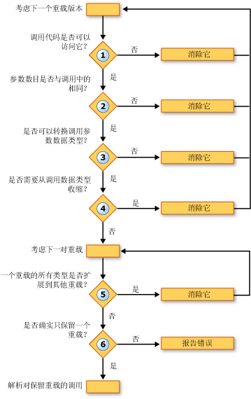

# 重载决策 (Visual Basic)
当[!INCLUDE[vbprvb](../../../../csharp/programming-guide/concepts/linq/includes/vbprvb_md.md)]编译器遇到对在多个重载版本中定义的过程的调用，编译器必须决定哪要调用的重载。 这是通过执行以下步骤︰  
  
1.  **可访问性。** 它会消除具有防止调用代码中调用它的访问级别的任何重载。  
  
2.  **参数个数。** 它会消除定义不同数量的参数提供的调用中的任何重载。  
  
3.  **参数数据类型。** 编译器会通过扩展方法为实例方法的优先级。 如果找到了，只需要经过扩大转换就能匹配的过程调用的任何实例方法，将删除所有扩展方法，并且编译器继续仅候选实例方法。 如果未不找到任何此类的实例方法，它将使用实例方法和扩展方法继续。  
  
     在此步骤中，它消除了调用参数的数据类型无法转换为形参类型中定义的任何重载。  
  
4.  **收缩转换。** 它会消除需要从调用的参数类型收缩转换为已定义的参数类型的任何重载。 这是 true 还是类型检查开关 ([Option Strict 语句](../../../../visual-basic/language-reference/statements/option-strict-statement.md)) 是`On`或`Off`。  
  
5.  **最小扩大。** 编译器会考虑对其余的重载。 对于每一对，它比较已定义的参数的数据类型。 如果中所有的重载之一类型扩大到中其他的相应类型，编译器可以消除后者。 也就是说，它将保留需要扩大的最少的重载。  
  
6.  **单个候选项。** 它将继续考虑重载直到只有一个成对重载仍将保留，并可消除对该重载的调用。 如果编译器不能减少为单个候选的重载，它会生成错误。  
  
 下图显示可确定哪一组要调用的重载版本的过程。  
  
   
在重载版本中  
  
 下面的示例阐释了此重载决策过程。  
  
 [!code-vb[VbVbcnProcedures #&62;](./codesnippet/VisualBasic/overload-resolution_1.vb)]  
  
 [!code-vb[VbVbcnProcedures #&63;](./codesnippet/VisualBasic/overload-resolution_2.vb)]  
  
 在第一个调用中，编译器消除第一个重载，因为第一个参数的类型 (`Short`) 缩小到相应的参数的类型 (`Byte`)。 它然后能消除第三个重载，因为每个参数类型中的第二个重载 (`Short`和`Single`) 加宽到第三个重载中的相应类型 (`Integer`和`Single`)。 第二个重载需要扩大量较少，因此编译器将用它的调用。  
  
 在第二个调用中，编译器不能消除任何根据收缩重载。 因为它可以调用带参数类型的最少扩大的第二个重载，它会出于同样的原因如下所示的第一个调用，消除第三个重载。 但是，编译器无法解析的第一个和第二个重载之间。 每个已扩大为中其他的相应类型的一种已定义的参数类型 (`Byte`到`Short`，但`Single`到`Double`)。 因此，编译器会生成重载解析错误。  
  
## 重载可选和 ParamArray 参数  
 如果某个过程的两个重载具有相同的签名只是声明的最后一个参数[可选](../../../../visual-basic/language-reference/modifiers/optional.md)合一和[ParamArray](../../../../visual-basic/language-reference/modifiers/paramarray.md)中另一个，则编译器将解析对该过程的调用，如下所示︰  
  
|如果该调用提供的最后一个参数为|编译器会将解析到声明作为最后一个参数的重载的调用|  
|---|---|  
|没有值 （省略该参数）|`Optional`|  
|单个值|`Optional`|  
|以逗号分隔的列表中的两个或多个值|`ParamArray`|  
|（包括一个空数组） 任何长度的数组|`ParamArray`|  
  
## 另请参阅  
 [可选参数](./optional-parameters.md)   
 [参数数组](./parameter-arrays.md)   
 [过程重载](./procedure-overloading.md)   
 [故障排除过程](./troubleshooting-procedures.md)   
 [如何︰ 定义一个过程的多个版本](./how-to-define-multiple-versions-of-a-procedure.md)   
 [如何︰ 调用重载的过程](./how-to-call-an-overloaded-procedure.md)   
 [如何︰ 重载带有可选参数的过程](./how-to-overload-a-procedure-that-takes-optional-parameters.md)   
 [如何︰ 重载参数数量不确定的过程](./how-to-overload-a-procedure-that-takes-an-indefinite-number-of-parameters.md)   
 [重载过程注意事项](./considerations-in-overloading-procedures.md)   
 [重载](../../../../visual-basic/language-reference/modifiers/overloads.md)   
 [扩展方法](./extension-methods.md)
