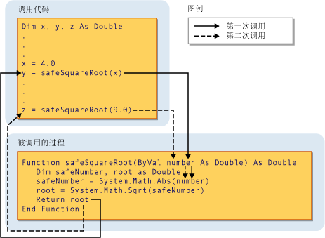

# 过程参数和变量 (Visual Basic)
[!INCLUDE[vs2017banner](../../../../visual-basic/includes/vs2017banner.md)]

多数情况下，一个过程需要有关调用环境的一些信息。  执行重复或共享任务的过程对每次调用使用不同的信息。  此信息包含每次调用过程时传递给它的变量、常量和表达式。  
  
 “参数”是指您在调用过程时过程期待您提供的值。  过程的声明定义过程的参数。  
  
 可以定义一个不带参数、带一个参数或带多个参数的过程。  指定参数的过程定义部分称为“参数列表”。  
  
 “变量”是指您在调用过程时提供给过程参数的值。  调用代码在调用过程时提供参数。  指定变量的过程调用部分称为“变量列表”。  
  
 下面的阐释显示从两个不同位置调用过程 `safeSquareRoot` 的代码。  第一个调用将变量 `x` 的值 \(4.0\) 传递给参数 `number`，`root` 中的返回值 \(2.0\) 被赋给变量 `y`。  第二个调用将文本值 9.0 传递给 `number`，并将返回值 \(3.0\) 赋给变量 `z`。  
  
   
将变量传递给参数  
  
 有关更多信息，请参见 [参数和变量之间的差异](../../../../visual-basic/programming-guide/language-features/procedures/differences-between-parameters-and-arguments.md)。  
  
## 参数数据类型  
 通过在参数声明中使用 `As` 子句为参数定义数据类型。  例如，以下函数接受字符串和整数：  
  
 [!code-vb[VbVbcnProcedures#32](./codesnippet/VisualBasic/procedure-parameters-and-arguments_1.vb)]  
  
 如果类型检查开关 \([Option Strict 语句](../../../../visual-basic/language-reference/statements/option-strict-statement.md)\) 为 `Off`，则 `As` 子句是可选的，不过，只要有任何一个参数使用它，则所有参数都必须使用它。  如果类型检查为 `On`，则 `As` 子句对于所有过程参数都是必选的。  
  
 如果调用代码需要提供的变量数据类型不同于它的对应参数（例如 `Byte` 对应于 `String` 参数），则调用代码必须执行下面一项操作：  
  
-   仅提供数据类型扩大到参数数据类型的变量；  
  
-   设置 `Option Strict Off` 以允许隐式收缩转换；或者  
  
-   使用转换关键字显式转换数据类型。  
  
### 类型参数  
 除了其正常参数外，“泛型过程”还定义一个或多个“类型参数”。  泛型过程允许调用代码每次调用该过程时传递不同的数据类型，这样可定制数据类型以适应每个调用的要求。  请参见 [Visual Basic 中的泛型过程](../../../../visual-basic/programming-guide/language-features/data-types/generic-procedures.md)。  
  
## 请参阅  
 [过程](../../../../visual-basic/programming-guide/language-features/procedures/index.md)   
 [Sub 过程](../../../../visual-basic/programming-guide/language-features/procedures/sub-procedures.md)   
 [Function 过程](../../../../visual-basic/programming-guide/language-features/procedures/function-procedures.md)   
 [Property 过程](../../../../visual-basic/programming-guide/language-features/procedures/property-procedures.md)   
 [运算符过程](../../../../visual-basic/programming-guide/language-features/procedures/operator-procedures.md)   
 [如何：为过程定义参数](../../../../visual-basic/programming-guide/language-features/procedures/how-to-define-a-parameter-for-a-procedure.md)   
 [如何：将参数传递给过程](../../../../visual-basic/programming-guide/language-features/procedures/how-to-pass-arguments-to-a-procedure.md)   
 [通过值和通过引用传递参数](../../../../visual-basic/programming-guide/language-features/procedures/passing-arguments-by-value-and-by-reference.md)   
 [过程重载](../../../../visual-basic/programming-guide/language-features/procedures/procedure-overloading.md)   
 [Visual Basic 中的类型转换](../../../../visual-basic/programming-guide/language-features/data-types/type-conversions.md)